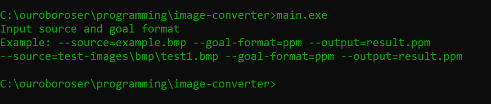
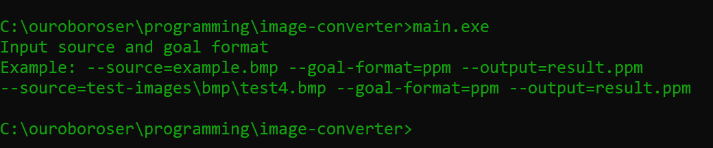
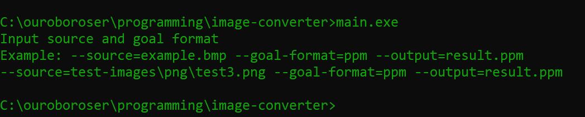
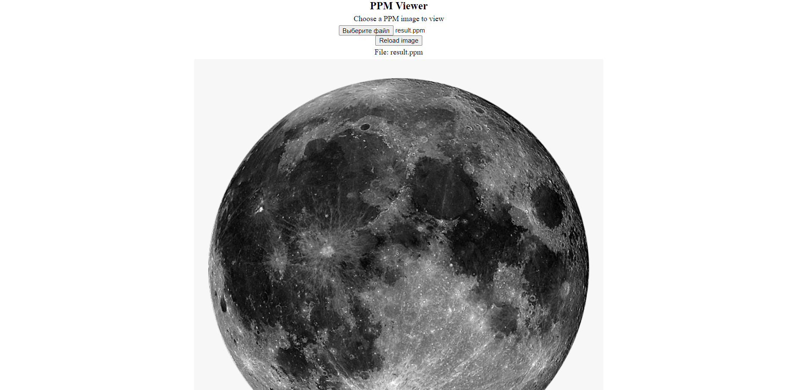

# Програма-конвертор різних файлів зображень

##### Формати, що були реалізовані
* bmp -> ppm
* png -> ppm

##### Приклад вхідної команди:
> --source=test-images\bmp\test1.bmp --goal-format=ppm --output=result.ppm

> --source=test-images\png\test1.png --goal-format=ppm --output=result.ppm

##### Приклад виконання програми:
1. bmp16 -> ppm

2. bmp24 -> ppm

2. png -> ppm

